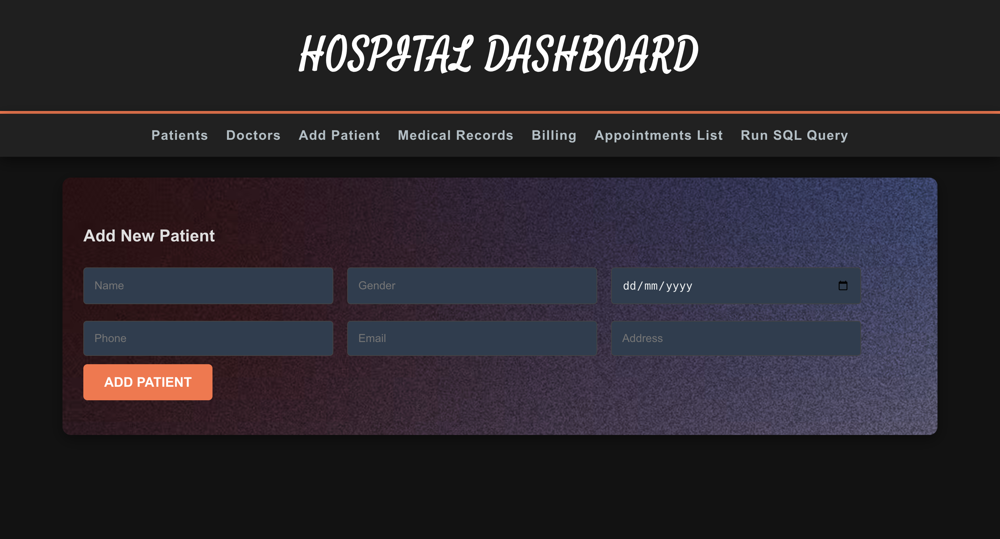
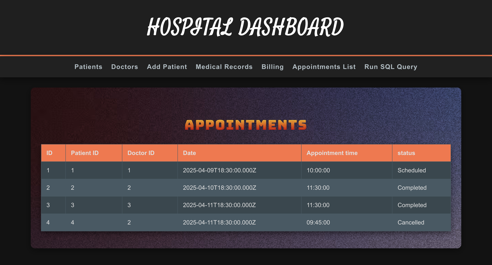
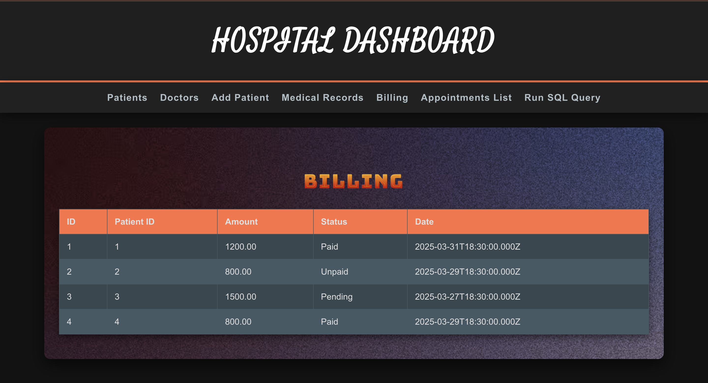

# MediSync – Hospital Management System 🏥

A full-stack web application built to streamline hospital operations including patient records, doctor schedules, appointments, and billing. Designed with a clean, user-friendly admin dashboard for efficient management.

## 🔧 Tech Stack

- **Frontend:** React.js, Vite, HTML, CSS, JavaScript
- **Backend:** Node.js, Express.js
- **Database:** MySQL
- **Tools & Platforms:** VS Code, Postman, Git.

---

## 📌 Features

- 🗂️ **Patient Management** – Add, edit, and view patient records  
- 🧑‍⚕️ **Doctor Scheduling** – Manage doctor profiles, availability, and departments  
- 📅 **Appointments** – Book and track appointments between patients and doctors  
- 💰 **Billing Module** – Generate and manage medical bills for patient visits  
- 🗃️ **Staff Dashboard** – View hospital-wide operations in a responsive UI

---

## 📷 Screenshots

### 🧠 Admin Dashboard

### 🧑‍⚕️ Add New Patient

### 📅 Appointments List

### 💳 Billing Interface

